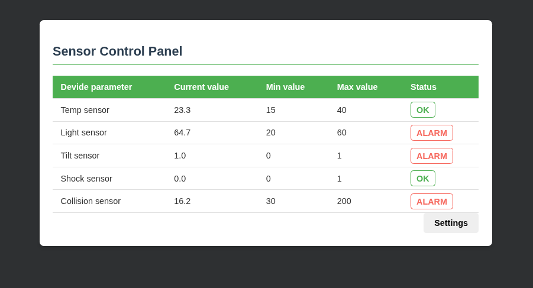
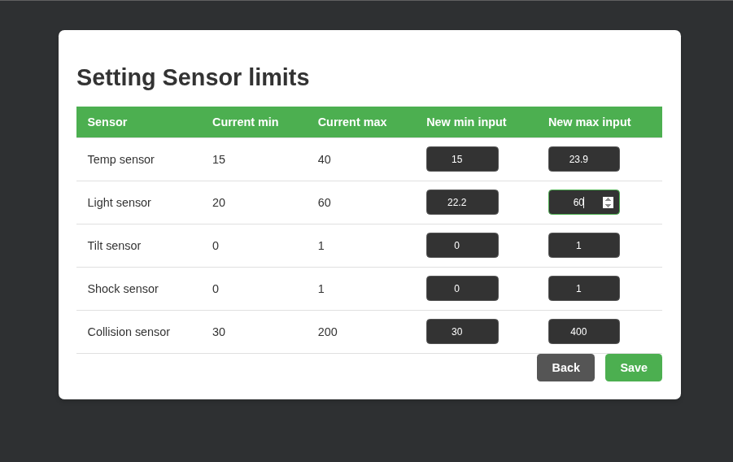
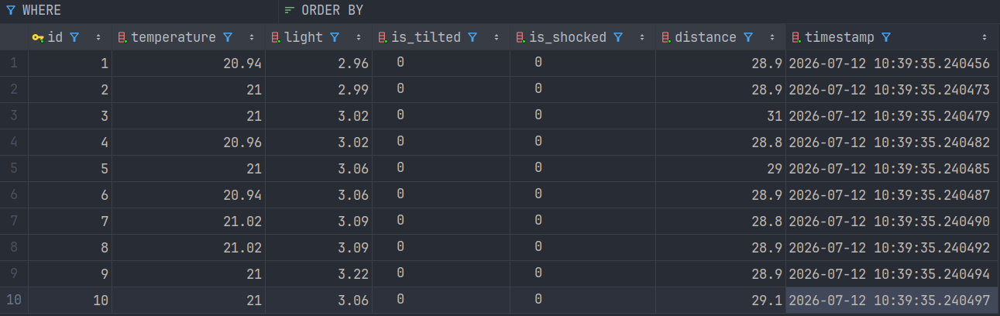

# Data Sensors

---

### ESP32-S3 Multi-Sensor Monitoring System in Rust

The project enables the simultaneous, thread-safe reading of data
from a set of environmental and mechanical sensors, and then
saves it to a database (`coming soon, currently in RAM`) and displays it on the HMI panel.

## 🛠️ Hardware Specifications

* **Microcontroller:** ESP32-S3
* **Memory:** 16MB Embedded Flash
* **Screen:** 128x64 OLED display based on the SSD1306 controller

| Module / Sensor                          | Pin for module | GPIO        | Operating mode / Bus          |
|:-----------------------------------------|:---------------|:------------|:------------------------------|
| **Temperature Sensor (KY-013)**          | Signal         | **GPIO 4**  | Analogue (ADC1_CH3)           |
| **Light Sensor (KY-018)**                | Signal         | **GPIO 5**  | Analogue (ADC1_CH4)           |
| **Tilt Sensor (KY-017)**                 | Signal         | **GPIO 6**  | Digital Input (Pull-Up)       |
| **Ultrasonic Distance Sensor (HC-SR04)** | Trig           | **GPIO 7**  | Digital Output                |
| **Ultrasonic Distance Sensor (HC-SR04)** | Echo           | **GPIO 8**  | Digital Input (Timekeeping)   |
| **Shock Sensor (KY-002)**                | Signal         | **GPIO 9**  | Digital Input (Pull-Up)       |
| **Ekran OLED SSD1306**                   | D0 (SCLK)      | **GPIO 1**  | SPI2 Hardware (Clock)         |
| **Ekran OLED SSD1306**                   | D1 (SDA)       | **GPIO 2**  | SPI2 Hardware (MOSI data)     |
| **Ekran OLED SSD1306**                   | CS             | **GPIO 15** | SPI2 Hardware (Chip Select)   |
| **Ekran OLED SSD1306**                   | DC             | **GPIO 16** | Digital Output (Data/Command) |
| **Ekran OLED SSD1306**                   | RES            | **GPIO 17** | Digital Output (Reset)        |

## Control Panel

---

## Settings Panel

---

## Database records

